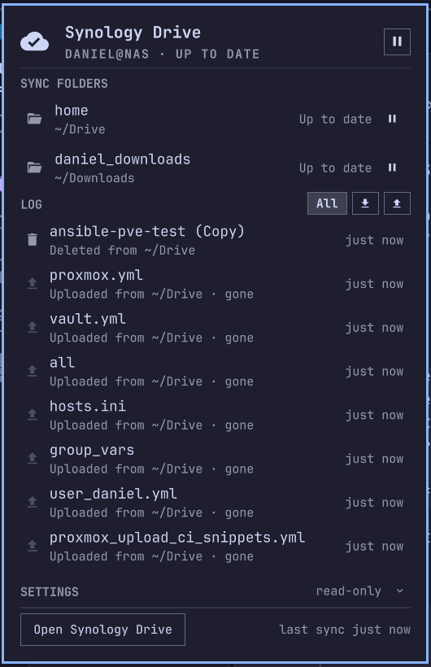

# Synology Drive

Synology Drive Client status in the [Omarchy](https://omarchy.org/) bar —
what's syncing, what failed, the sync log — without the Qt tray icon.

The official Synology Drive Client for Linux syncs well and looks dreadful
under Hyprland: an XWayland Qt5 tray icon whose popups die on hover. This
plugin leaves the client doing the syncing and replaces only the part you
look at. It reads the state the client already keeps on disk (its SQLite
databases and daemon log under `~/.SynologyDrive`), so there is nothing to
configure, no credentials, and no traffic to the NAS.




## Install

No setup, no root. The Synology Drive Client must be installed and linked
(`synology-drive-client-bin` or `synology-drive` from the AUR).

```bash
omarchy plugin add https://github.com/DanSmith888/omarchy-synology-drive.git --enable
```

### Hide the old tray icon

Once the pill is up, hide the client's own tray item. Right-click it in the
Omarchy tray and choose hide, or add it to the tray's hidden list in
`~/.config/omarchy/shell.json`:

```json
{ "id": "omarchy.tray", "hidden": ["cloud-drive-ui"] }
```

The client keeps running; only its icon goes.

### Check it

```bash
~/.config/omarchy/plugins/dansmith888.synology-drive/bin/syndctl doctor
```

Verifies every link from the client to the bar and tells you how to fix
whatever is broken. Put `bin/` on your `PATH` if you want `syndctl` as a
command.

## Update

```bash
omarchy plugin update dansmith888.synology-drive && omarchy restart shell
```

## Remove

```bash
omarchy plugin remove dansmith888.synology-drive
```

That removes everything. The plugin never touches anything outside its own
folder and a lock file in `$XDG_RUNTIME_DIR`.

## Using it

**The pill** is a cloud glyph that only says something when there is
something to know:

| Pill | Meaning |
|------|---------|
| 󰅠 | Up to date |
| 󰘿 3 | Syncing — 3 files pending; the glyph alternates with ↓/↑ for the current file |
| 󰅟 Paused | Paused in the client |
| 󰅤 Offline | The NAS can't be reached; the client is retrying |
| 󰧠 Error | A connection or task error — see the panel |
| 󰅤 | Client not running / not linked |

**Left-click** opens the panel. **Right-click** pauses or resumes all
syncing. **Middle-click** forces a refresh. From a hotkey:

```bash
omarchy-shell shell toggle dansmith888.synology-drive
omarchy-shell dansmith888.synology-drive pause     # or resume
```

**The panel** shows, top to bottom:

- who you are linked as, the overall state, and a pause/resume-all button;
- **Now** — the file being transferred, its direction and size, and what is
  queued behind it (only while something is moving);
- **Sync folders** — each task with its local path and state; click to open
  the folder, or use its pause/resume button;
- **Problems** — files the client refused to sync, with the reason (only when
  there are any; temporaries excluded by the client's own filter are not
  problems and are not listed);
- **Log** — the client's sync history, newest first, scrolling. Filter to
  downloads or uploads. Click an entry to select that file in Files; entries
  whose file is gone are dimmed;
- **Settings** (folded) — the client's options as it has them, read-only:
  startup, notifications, overlay, per-task direction and filter rules;
- **Open Synology Drive** for everything else.

Keys while open: `p` pause/resume all, `r` refresh, `o` open the client,
`s` fold/unfold settings, arrows scroll the log, `Esc` closes.

### Settings

In the Omarchy bar editor (or `shell.json`):

- `hideWhenIdle` (off) — hide the pill entirely while everything is up to date.
- `logCount` (40) — how many log entries the panel keeps.

## What it does

- **State** comes from `~/.SynologyDrive/data/db/sys.sqlite` (connection,
  sync tasks) and a tail of `~/.SynologyDrive/log/daemon.log` (what is
  queued, what is moving, pause/offline markers). The daemon narrates every
  transfer as `PushEvent` / `PullEvent` / `DoneEvent` and announces an idle
  folder with "event pool is now empty", which is exactly what the tray
  icon reacts to.
- **History and problems** come from `history.sqlite`, the same table the
  client's Logs page shows.
- **Pause / resume** talk to the sync daemon over its local socket
  (`~/.SynologyDrive/daemon.sock`) with the very request the client's own
  Pause button sends — `{"action": "pause", "session_id_list": [...]}` in
  Synology's PStream encoding — and confirm it from the daemon log. Per
  task or all at once. Everything about that channel is in
  [PROTOCOL.md](PROTOCOL.md).
- Nothing else is written: no client setting, nothing under the sync folders.

## Requirements

- Omarchy (Quattro or later)
- Synology Drive Client 4.x for Linux (tested with 4.0.3-17892), linked to
  a NAS
- Nautilus for "show in Files" (falls back to `xdg-open` on the folder)

## Command line

```
syndctl get [--json]              connection, sync folders, activity, state
syndctl log [-n N] [--json]       sync history, newest first
syndctl unsynced [--json]         files the client refused to sync
syndctl settings [--json]         the client's options, read-only
syndctl pause [<session-id>...]   pause syncing (all tasks, or the given ones)
syndctl resume [<session-id>...]  resume syncing
syndctl show                      raise the client's own window
syndctl open [<session-id>]       open a sync folder in the file manager
syndctl reveal <path>             select a file in the file manager
syndctl ipc <action> [k=v ...]    raw request to the daemon (see PROTOCOL.md)
syndctl doctor                    check every link from the client to the bar
```

## Good to know

- **Pause is not persisted by the client.** It lives in the daemon's memory,
  so a client restart or reboot resumes syncing — same as the native button.
- **The native app's own status lags behind pauses made from the bar.** Its
  tray tooltip and window only reflect pauses it performed itself; the
  daemon (which the plugin reads) is right, the app catches up on its next
  own action. Pauses made *in* the app — by task or by connection — show up
  in the plugin within one poll.
- **Don't use `synology-drive pause`/`resume` from the launcher.** On 4.0.3
  `pause` sends a `reload_session` that rewrites a per-task option
  (`sync_mode`) and pauses nothing; `resume` is a no-op. The plugin never
  calls them.
- The daemon acknowledges every request, valid or not; the plugin therefore
  treats the daemon's own log line ("Pause session N by session id") as the
  confirmation, and says "sent (daemon has not logged it yet)" when it does
  not appear within a few seconds.
- "Pending" counts come from the daemon log, not a live query, so they are
  accurate to the poll interval (4 s while syncing) and can miss files that
  were queued before the current log file started. The daemon rotates its
  log at 5 MB; the plugin reads the newest rotated file too when the live
  one is young.
- The plugin polls: every 6 s idle, 4 s while syncing, 3 s while the panel
  is open, and whenever you hover the pill. Each poll is one short Python
  process (~130 ms).
- If the client is not running the pill shows a struck-through cloud and
  the footer button starts it.

## What runs, and as whom

Omarchy plugins run inside the shell process, unsandboxed, as your user.
This one runs two Python scripts from its own `bin/` — standard library
only, no extra packages, no binaries, no network, nothing that needs root.
It opens the client's databases read-only, reads its log, sends pause /
resume / event-count requests to the daemon's local Unix socket, and writes
nothing outside its folder except a lock file in `$XDG_RUNTIME_DIR`. The
only things it ever executes besides itself are `synology-drive show`,
`nautilus --select` and `xdg-open`.

## Licence

MIT — see [LICENSE](LICENSE).
